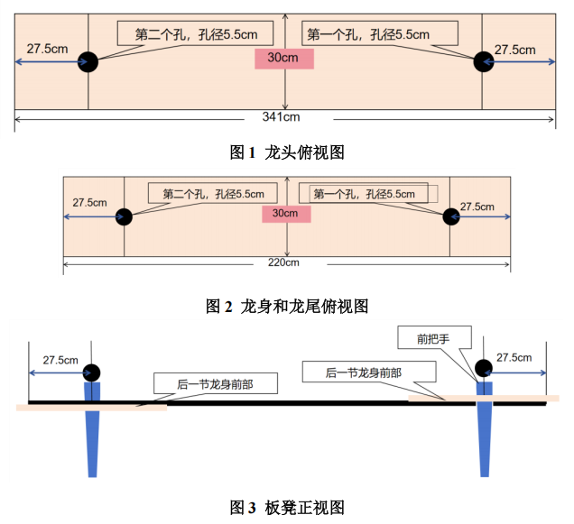

# 基于递推模型与几何模型的“板凳龙”运动问题研究

## 摘要

板凳龙是浙闽地区的传统民俗活动，以庆祝丰收和祈求吉祥为目的，常见于节庆和庙会中。本文利用把手位置递推模型以及板凳碰撞模型、螺距补偿模型等几何模型来研究“板凳龙”的运动问题，旨在解决“板凳龙”运动轨迹、时间、速度等问题。

针对问题一，本文建立了把手位置递推模型：首先根据初始位置和螺距构建极径 与极角 的函数关系，再根据初始速度1m/s构建极角 和时间 的函数关系，其次根据直角坐标与极坐标之间的关系可以得到把手位置与极角 的函数关系， 然后根据两把手之间的距离可以递推全部把手的位置信息，最后对把手位置求时间的导数即可得到把手速度。将相关数据代入模型求解分析可知，随着时间的增加，各把手的速度不断增大并趋向于1m/s。

针对问题二，本文建立了板凳碰撞模型：首先通过几何关系确定发生碰撞的位置，再将龙头前把手的运动轨迹近似认为是“板凳龙”的运动轨迹，通过碰撞点与前把手的位置关系确定了碰撞点的坐标，然后根据点到直线的距离公式得到碰撞点位置与板凳宽度之间的关系，最后根据板凳宽度确定约束条件。将相关数据代入模型，通过数值模拟的方式求解可得，舞龙队盘入的终止时刻大约为412.58 s。

针对问题三，本文建立了螺距补偿模型：首先将“板凳龙”沿螺旋线盘入的情况近似认为是螺栓拧入螺母的情况，再以龙头碰撞点位于相邻板凳边缘中点时为临界情况，从而确定最大螺距补偿系数 ，然后将螺距补偿模型几何化，通过第二问的板凳碰撞模型可以得到龙头板凳以及龙头相邻板凳前后把手的位置信息，最后根据平面解析几何、勾股定理、方程平移等相关知识确定螺距补偿系数 。将相关数据代入模型，通过matlab编程求解可以得到临界螺距 为45.21 cm。

针对问题四，本文建立了圆弧调整模型：首先确定盘入螺旋线、盘出螺旋线与调头空间之间的切点位置，再通过切点的性质找到圆心所在直线，根据题目所给出大小圆弧半径，且各部分均相切，进而对圆心位置与半径大小进行判断，最后得出调头路径的长度始终为14.137 m。针对求解板凳龙运动信息的问题，本文建立了基于时间的把手位置递推模型：首先对不同时间龙头前把手的位置进行分类，再利用几何关系计算得到龙头位置信息，然后根据递推模型得到各把手的位置信息，最后对把手位置求时间的导数得到把手速度。将相关数据代入模型求解分析可知，各把手速度的变化规律基本符合问题一中得出的变化规律，进一步验证了模型的合理性。

针对问题五，本文建立了鞭尾速度模型：首先将“板凳龙”近似看成是一条鞭子，认为龙尾后把手处速度最大，再根据曲率与速度的关系得到，调头曲线半径越小速度越大的结论，然后可以将问题简化为求解当龙尾后把手速度为2m/s时的龙头速度，最后通过平面解析几何求得龙尾后把手的坐标。将相关数据代入第四问的递推模型求解得到龙头的最大行进速度为1.812 m/s。

最后，本文还对模型进行合理性分析与推广，探讨了模型在不同场景下的应用潜力和可能面临的挑战，为未来的研究提供了参考。

关键词：递推模型；板凳碰撞模型；螺距补偿模型；鞭尾速度模型；平面解析几何

## 问题背景

“板凳龙”是浙闽地区的传统民俗活动，人们将数条板凳首尾相连，形成一个圆盘状的“盘龙”，在舞龙队能够自由盘入、盘出的前提下，整体的面积越小则行进速度越快。现有一板凳龙由223节板凳组成，第一节为龙头，最后一节为龙尾，其余均为龙身。板宽均为30 cm，龙头长341 cm，龙身和龙尾长均为220 cm，每节板凳上有两个孔，孔径为5.5 cm，孔的中心到相邻最近的板头距离为27.5 cm (见图1和图2)。板凳龙的连接方式见图3。

## 问题提出

- 问题1：问题要求针对舞龙队龙头的初始位置结合运动过程，构建一个模型，用以计算每秒整个舞龙队的速度与位置。
- 问题2：问题要求根据问题一的设定，考虑板凳之间不发生碰撞的情况下舞龙队盘入的时间，并计算出舞龙队的位置与速度。
- 问题3：问题要求通过所设定螺线中心为圆心、直径为9 m的圆形调头区域计算出舞龙队逆时针盘出时所需最小调头空间的螺距。
- 问题4：问题要求在问题三设定下调整圆弧，使其保持各部分相切，调头曲线变短。并计算出问题所给时间段中，每秒舞龙队的位置和速度。
- 问题5：在问题四设定的路径中，根据所给条件求出龙头最大行进速度，使得各把手的速度不超过2m/s。
